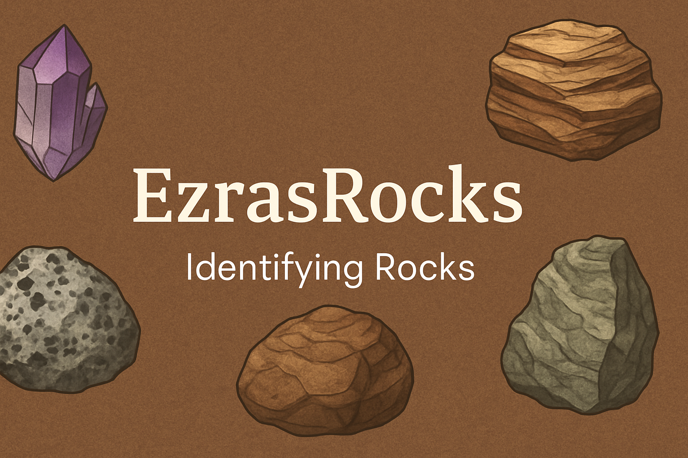

# EzrasRocks

A Flask web app for real-time rock classification on NVIDIA Jetson using an ONNX model, with image preview, user-friendly UI, and logging.

## The Algorithm

This project uses an AI-powered image recognition system trained with the Jetson Inference toolkit to identify and classify 5 different types of rocks: Basalt, chert, Clay, Conglomerate, Diatomite, gypsum, olivine-basalt, Shale, and Siliceous-sinter. The training is performed on an NVIDIA Jetson device using PyTorch, and results are saved as model checkpoints. A Python script handles inference, taking input images and returning predicted labels with confidence scores. The code relies on Jetson Inference, OpenCV, and standard Python libraries. It also includes an optional Web UI, where users can input images directly from their computer to be analysed by EzrasRocks.

## Running this project

1. Download both my Jetson-Infrence folder and Rock-Ai-Web and put them both on the root of your Jetson after connecting with VScode.
2. Open a new terminal, make sure you are on bash.
3. Run "pip3 install numpy==1.24.4" (your numpy installed automatically is too new for the system to use.)
4. Run "python3 app.py"
5. Open the link to the WebUI in your browser, which will usually pop up on the bottom right of the screen.
6. Download the file SampleImages to your computer.
7. Import one by clicking the "Choose File" button and choosing one of the sample images, named after their respective rock.
8. Click the "Classify Image" button to classify it with EzrasRocks.
9. After finished, the image should both display and be accompanied by a confidence score and the class the model thinks it is.
10. The classification should also be logged below the image in the Classification Log.
